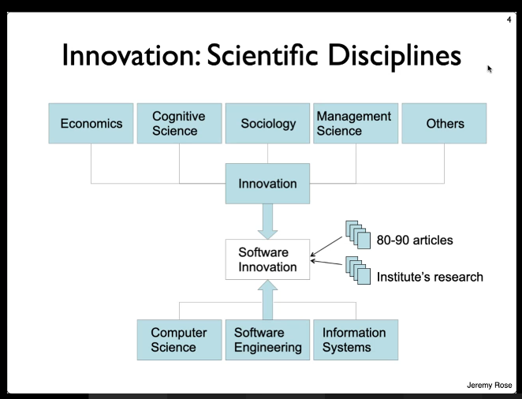
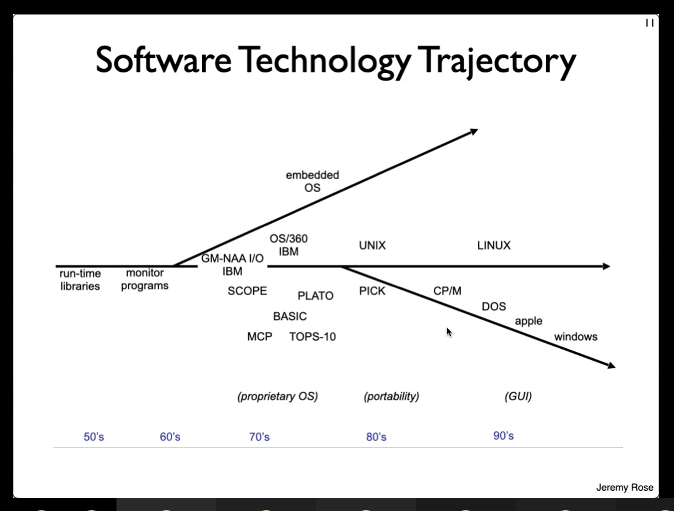

# Overview of Software Innovation (SWI)
1. [Essence: Pragmatic principles and concepts](#topic-1-essence-pragmatic-principles-and-concepts)
1. [Essence: Roles and project organization](#topic-2-essence-roles-and-project-organization)
1. [Essence: The Pre-project and Ecology](#topic-3-essence-the-pre-project-and-ecology)
1. [Essence: The Pre-project and Leverage](#topic-4-essence-the-pre-project-and-leverage)
1. [Essence: The Prospect concept and Prospect Scenarios](#topic-5-essence-the-prospect-concept-and-prospect-scenarios)
1. [Essence: Configurations – Tactics, Strategy and Rationale](#topic-6-essence-configurations-–-tactics,-strategy-and-rationale)
1. [Essence: Configurations – Paradigm, Product, Project and Process](#topic-7-essence-configurations-–-paradigm,-product,-project-and-process)
1. [Essence: Project management, ETVX – Pivot or Persevere?](#topic-8-essence-project-management,-etvx-–-pivot-or-persevere)
1. [SI: The innovative software product](#topic-9-si-the-innovative-software-product)
1. [SI: Innovation trajectories and windows](#topic-10-si-innovation-trajectories-and-windows)
1. [SI: The innovative software process](#topic-11-si-the-innovative-software-process)
1. [SI: The creative software developer](#topic-12-si-the-creative-software-developer)
1. [SI: The innovative software team](#topic-13-si-the-innovative-software-team)
1. [SI: Innovation and community](#topic-14-si-innovation-and-community)
1. [SI: Software innovation evaluation](#topic-15-si-software-innovation-evaluation)
1. [Future Research in Agile Systems Development: Applying Open Innovation Principles Within the Agile Organisation](#topic-16-future-research-in-agile-systems-development-applying-open-innovation-principles-within-the-agile-organisation)
1. [A Lightweight Innovation Process for Software-Intensive Product Development](#topic-17-a-lightweight-innovation-process-for-software-intensive-product-development)

# Topic 1: Essence: Pragmatic principles and concepts
ESSENCE:
* Views: Product, Paradigm, Project, Process
* Roles: 

* Part of everyday work in software projects.
* Innovation tager hånd om _ikke-trivielle problemer_ opdaget i problemdomæney
* Hvad problemet er og hvad der kan løse det er problematisk. KAN ændre arbejdet på problemet.

* Product: Nyt produkt
* Process: 
* Project: Part of a solution
* Paradigm: When 

## 3 paradigmer af software udvikling
* Dokumentorienteret: Vandfald. Top-down, **PLANorienteret**
* Agil: Incremental, dynamisk, **brugerfokuseret**
* Pragmatisk: Hyperkompleks. **Problem-orienteret**.
  * Hyperkompleks: SÅ MEGET kompleksitet at man ikke kan lave tage hånd om det inden rimelig tid. 
    * Systemer kan ikke længere seperares fra hinanden.
    * Systemer skal være mere intelligente.

## Core concerns

## Structures in ESSENCE

## Idé
En hypotese. Et eksperiment. Vi kan teste det og se om det virker.

# Deweyan Situation

# Deweyan Inquiry

# Means and Ends

# Topic 2: Essence: Roles and project organization
* Child: Ideas without responsibility
  * Questions and propositions contrary to previous decisions. External companies or users or even developers.
  * Is this the right problem we are working on?
  * A thinker of the problems. 
* Responder: Any developer applying the Product View. Technology.
  * Developers and majority in team
  * Technology expertice
  * Responders and challengers engage in continous dialog.
* Challenger: Challenges the idea
  * Problem domain.
  * Customer focus.
  * Main source of knowledge to the project.
  * Prioritizez features and accepts solutions.
  * Could be multiple. But MUST agree on direction.
* Anchor: Process view. Evaluations and focus.
  * NOT the team leader.
  * Reponsible for keep team absorbed.
  * Evaluations, NOT decide on consequences.

Sanguine: Offers new ideas
Choleric: Brænder for noget. 
Phlegmatic: Hvordan undgår jeg problemer i projektet?
Melancholic: Challenger. Worrysome. Balance char.

Why roles:
* Boundaries
* Share knowledge
* Fair evaluations
# Topic 3: Essence: The Pre-project and Ecology
# The Pre-Project
Hypercomplexity: Cannot scope a project optimatically from the start.
Balance between ambitions and the doable.
SCOPE the problem. Create an **INITIAL** scope.

Ecology: Hvilke eksterne services, artifakter, personer i problem domænet ville det være strategisk vigtigt at interface med?

*Anthropocene age*: Environment is largely formed by human activity.
Need to start the project on set of assumptions about the environment.

## Figur: VENSTRE SIDE

## Ecology filter

### Taxonomy
* External services: Use without modification
* External artifact: Sensors, actuators.
* External repositories: Collecting, storing or aggregating information via trvial interfaces
* External People: Specific people, organizations stakeholders.

### Divergent & Convergent thinking
* Divergent: ALLE muligheder til at nå en løsning
* Convergent: For ***én*** løsning

## Evaluating Ecology Ideas

### Single idea evaluation
* SWOT
* PMI-evaluation 
  * Plus: Positive.
  * Minus: Negative.
  * Interesting: Others.

### Comparative idea evaluation
* NAF-evaluation
  * Novelty
  * Attractiveness
  * Feasability

* SWOT
  * Translate numbers into numbers.

* Pairwise Comparison

Linker MEGET sammen med [Leverage](essence_preproject_leverage.md)
# Topic 4: Essence: The Pre-project and Leverage
# The Pre-Project
Hypercomplexity: Cannot scope a project optimatically from the start.
Balance between ambitions and the doable.
SCOPE the problem. Create an **INITIAL** scope.

Leverage: Hvilke teknologier burde blive tilegnet som keystones, centrale principper i en god løsning?

Newer technologies may arrive that we cannot expect.

## Figur: HØJRE SIDE

## Leverage filter

## Taxonomy
* Technologies
* Internal artifacts
* Internal repositories
* Internal people: Users, social networks.

Jem & Fix, Harald Nyborg vs Silvan, Bauhaus:
Silvan har "faglærte" medarbejdere, mens discount har ikke.

## Evaluation:
### Single-idea evaluation
* SWOT
* Value Analysis

* PCRT: 
  * Power
  * Cost
  * Risk
  * Time

## Comparative Idea Evaluation
* PCRT
* Samme teknikker som til [Ecology](essence_preproject_ecology.md)
# Topic 5: Essence: The Prospect concept and Prospect Scenarios

# Topic 6: Essence: Configurations – Tactics, Strategy and Rationale

## Tactics, strategy and rationale

# Topic 7: Essence: Configurations – Paradigm, Product, Project and Process
# Topic 8: Essence: Project management, ETVX – Pivot or Persevere
SCRUM: Focus on what to build and where to build.  RØD i figur

Essence: Reasoning in the project. GRØN i figur
Rationale
Strategy
Tactics

Look into the planing of the project at the start of the sprint. Sprint review is also used to review the RST.

## ETVX
* Entry Criteria: criteria that should be satisfied before beginning the task
* Task: Descriptions of what is to be accomplished by the cell.
* Validation: Procedures to ensure the quality of what is accomplished by the task.
* eXit Criteria: Criteria that should be satisfied for the activity to terminate.

Design by contract.
If we send the right data into the model and implemented correctly, we have a guarantee of the output. A model of the configuration table. 

## BASED ON THE REVIEW, we decide: Pivot or Preservere?
Bliver til en træstruktur hvoraf man kan beslutte om man skal fortsætte eller pivot.

Reasons to Pivot:
* Internal inconsistencies
* External dynamics - Changes in one place may incour changes in the project.
  * IT value
  * Business value
  
# Topic 9: SI: The innovative software product
# Innovative Product

Målt på 2 ting: Novelty og utility - på dansk: Nyhed og anvendelighed.

Novelty: Et produkt med høj novelty er noget som aldrig før er udviklet. Dog er det vigtigt at huske på at novelty er både afhængig af tid og brugere. Et produkt kan godt være nyhedsskabende for en gruppe brugere selvom det har eksisteret i lang tid.

Utility: Der er en del anvendelighed i produktet og det er brugerne villige til at betale for. Her kommer markedet med ind i billedet med alternativer og rivaler og deres priser.

*Innovation (invention + exploitation + diffusion) leads to social change* - side 39 i SI.

Altshuller's heiraki af tekniske systemer:

Novelty levels:
* level 1: rutine problemer løst af metoder der er velkendte.
* level 2: mindre forbedringer til et eksisterende system ved brug af metoder kendt i industrien.
* level 3: fundementale forbedringer ved brug af metoder kendt uden for industrien.
* level 4: en ny generation af systemer som har et nyt princip for at lave systemets primære funktioner - løsningen er oftest fundet i videnskaben end teknologi.
* level 5: en sjælden videnskabelig opdagelse eller innovation af et nyt system.

Et godt eksempel på dette er i min optik facebook ja tak tilbud.
Nu skal stort set alle butikker have et Ja-tak tilbud på facebook således at deres side kan brandes.

### Innovation utility form 1: computing infrastructural
Innovation for at noget andet infrastruktur nemmere at bruge. FX: Operativ system, netværksprotokol osv.

### Innovation utility form 2: technology enabling
Det at en robotstøvsuger kan bruges kan gøre at teknologien kan innoveres på.

### Innovation utility form 3: user service
Bedre bruger services: mere effektivt, billigere osv. Personligt eksempel: Discord. Et chat service som gør at man kan være med i MANGE små grupper uden at de skal kende til hinanden. Nemmere at lave gruppesamtaler.

### Innovation utility form 4: business change enabling

### Innovation utility form 5: interaction and communication

### Innovation utility form 6: entertainment

Innovative software produkt skal tage højde for følgende:
* Novelty (nyheden)
* Utility (anvendelighed)
* User community 
* Social change 
* Market
* Technical Innovation
* Infrastructure dependency

# Topic 10: SI: Innovation trajectories and windows
# Software innovations vinduet
Det korrekte tidspunkt at bygge en applikation.

Når teknologien er moden nok.
For sent på marked: 
* Risikere konkurrence.
# Topic 11: SI: The innovative software process
## Rose kapitel 4

### Vandfaldsmodellen
Hvert skridt skal være fyldt ud inden man kan gå til næste skridt.

### Boeing innovation model

## Promovere agile metoder innovation?
Iflg. Rose: Nej. 
Nogle elementer af agil udvikling er nødvendig for software innovation, men en agil process er ikke nok.

### Innovation ledet af marked eller teknologi

## 6 innovation process strategier
* 1: creative requirement analysis
  * Kreativitets tilstande: Exploratory, combinatorial and transformational. Lære fra _BRUGERNE_. 
  * HJÆLPE brugere til at innovere.
* 2: the designed process framework
  * Brugerne ved måske ikke hvad der er muligt.
  * Udviklere tager ansvar for idé generering.
  * Hjælpe UDVIKLERE med at innovere.
* 3: low tech prototyping
  * Fra papir, til mockups, til mere højtek kode simulationer og kode prototyper
  * Low cost experimentation, rapid learning.
* 4: user-driven software innovation
  * Læner sig op ad "superbruger" for at kunne høre om deres idéer og så implementere dem i kode.
  * Adgang til domæne eksperter.
* 5: community development
  * Innovation som et samfund. 2 måder: Lead user community som Apache foundation eller content model som fx Second Life.
  * Udvikler = bruger ekspertise.
  * Eksempel: Apache webserver.
  * MANGE ekspert hænder.
* 6: the research prototype
  * External funding
  * Grouping of organizations.
  * Example: KIWI
  * Public and private funding to develop prototypes.
  * Collaboration with researchers at knowledge boundaries.

## Personal creativity
* Copy
* Transform
* Combine

## Overblik
Den innovative software udvikler skal take kontrol over processen.
Udviklere skal mixe og matche hensigtsmæssigt. 
**Process går i stå**: Udvikler skal introducere noget ind til processen som gør at de kan komme videre.
**Processen garantere ikke success**
# Topic 12: SI: The creative software developer
# Topic 13: SI: The innovative software team
# Rose kapitel 6

3 forskellige teams:
* Dysfunctional team - Folk arbejder i små grupper
* Functional team - Folk arbejder sammen
* Innovative team - ??

## Scientific disciplines

## Software innovation Overview:
* **Invention**: The creative act or process and its result (e.g. a software program). The good idea.
* **Exploitation**: Commercial development and adaptation to practical situations. Product starts being used
* **Diffusion**: Adoptation by a wider audience. Audience takes it.

Entrepanear crates a new something:
* New product
* New process

Eventually competitors catch up and crate a new equlibrium.

Jeremy's perspective:
Linking between process and product.
Rover to Mars: No changes.

In Essence innovation: We only talk about when we change the life of someone else.
Something that affects someone else.

Jeremy: Our only changes to our own process and calls that innovation.

## Technology trajectory

## Technology convergence

## Innovation community
* Physical: Silicon Valley, Shenzhen
* Virtual: GitHub for open source

## Innovation networks
* Invisible college, through network
* Knowledge exchange: Two way flow of 
* Innovation as a social process. Domain, field and individual.
  * 
* Reflective practice
* Knowledge as a social process.

## Knowledge: Absorptive Capacity

## Innovation/Creativity Factors
* Negative Factors
  * Creativity barriers
    * *Time pressure*
    * *Stress*
    * Bureaucracy
    * *Routine work*
    * *Resource shortage*
      *Kursiv = promote creativity*
  * Group dysfunction
* Positive factors
  * Software team roles
    * Formative:
      * XP: Coach, programmer, tester
      * SCRUM: Product owner, scrum master
    * Innovative:
      * ESSENCE: Challenger Responder, Anchor, Child
  * Communicative interactions
  * team learning
  * Expertise integration

# Topic 14: SI: Innovation and community
## Community
Det miljø som udvikleren færdes i.
Silicon Valley er et fysisk eksempel.

Personligt eksempel: Hackerspaces.
# Topic 15: SI: Software innovation evaluation
Rose siger at man skal vide hvornår man ikke er innovativ.
Til dette er der en række metoder:

## Innovative software product assessment
Måler 3 aspekter på 3 dele af produktet.
* Novelty
* Resolution
* Synthesis & elaboration

De 3 dele af produktet er:
* Project idea
* Organizational
* Technical

## Assessment overview

## Here-and-now quick-and-dirty
* Keep your head up
* Grow your knowledge community
* Target your product's innovation profile
* Shape your own process
* Develop your person creativity
* Be a super-team-worker
* Bring your toolbox

## SCAMPER
Some part of the solution, but unhappy with solution. 
* S = Substitute
* C = Combine
* A = Adapt
* M = Magnify
* P = Put to other uses
* E = Eliminate (Or minify)
* R = Rearrange (or reverse)

## Six serving men
* Who (will use the main features?)
* What (Which components and architectures?)
* Where (Are the main features used?)
* When (Should components be availble)
* Why (are these main features needed)
* How ( is a feature established)

## Innovation Games
* Show and tell
* Product box

# Assessment and evaluation
Psycho-metric - measureing the strenghts and weeknesses of people

## Work Environment Inventory (WEI)
* Six parameters
  * Freedom
  * Challenging work
  * Sufficient resources
  * Supervisory encouragement
  * Work group support
  * Organizational encouragement
# Topic 16: Future Research in Agile Systems Development: Applying Open Innovation Principles Within the Agile Organisation
# Future research

* Agile approches move away from introverted into customer in all areas of the decelopment
* Support innovation and value-creation
* Customer COULD have too narrow focus. Customer cannot know EVERYTHING.
* Theres a reason why you have single point of access. Development can be stalled due to policy. Multiple stakeholder outside the business unit.

## Purpose
* Intra-organizationl.

## Agile and Creativity.
* *Creativity*: Produce work considered novel, appropiate and adaptive.
* *Creative activites*: Pivotal role all aspects of IT development.
Integration and things.

## Agile and Innovation
* Agile approach best employed to explore new ground.

## Organizational levels
* Inter-organizational: Accross companies.
* Intra-organization: Between business units INSIDe the company.

# Closed and open innovation
* Traditional innovation process: *linear approach*
  * Con: Secrecy. 
## Open innovation:
* Not all the smart people work for us.
* External R&D

##
* Innovation collaboration between the agile team and other stakeholders
* Role of the project manager
* intra-oganization stakeholder involvement

# Topic 17: A Lightweight Innovation Process for Software-Intensive Product Development
# A lightweight innovatio process
Focus is on here and now. A dollar today is better than a dollar tomorrow.
*RISK*: Innovation and competitive advantage decreate over time and productivity will lead to diminishing returns.

Do a lot of reactive product development.
Problem 

## Star Search
* Encourage innovation from the WHOLE organization
* Selection MUST be cost-effective to compete.
* Any more heavy weight dont stand a chance.
* !! Difference from ESSENCE: Star search is competition with short-term development. ESSENCE: Part of the development.

## Process Improvement
* Repeatability
* Predictability
* Controllability

## Part of day-to-day business
* Lightweight
* Part of day-to-day business compared to "new idea workshop".

## Product or Process innovation
* Same.
* ESSENCE: External innovation. How can we change the world of the customer.

## Star search 4 steps:
1. Call for innovation: Get a bunch of ideas
2. Audition: 30-45 min presentation of the idea.
3. Prepapration: 
4. Decision: 
Stops BEFORE realization
ESSENCE: decisions and realization GENNEM development

EVERYONE is a part of the innovation process.
