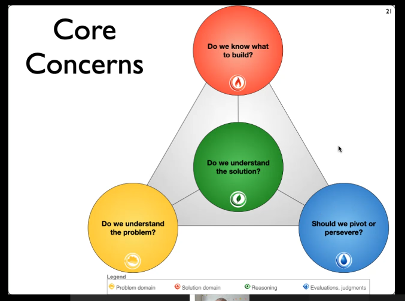
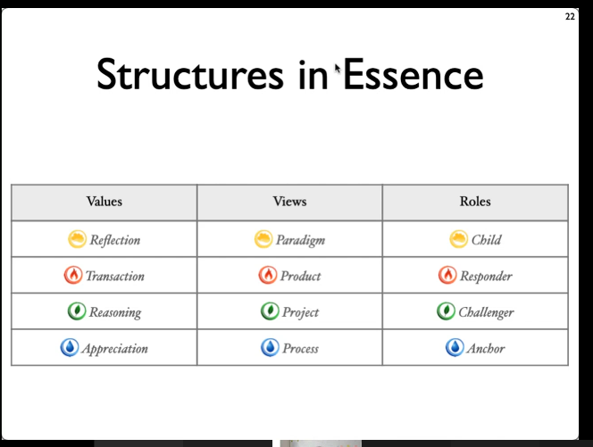
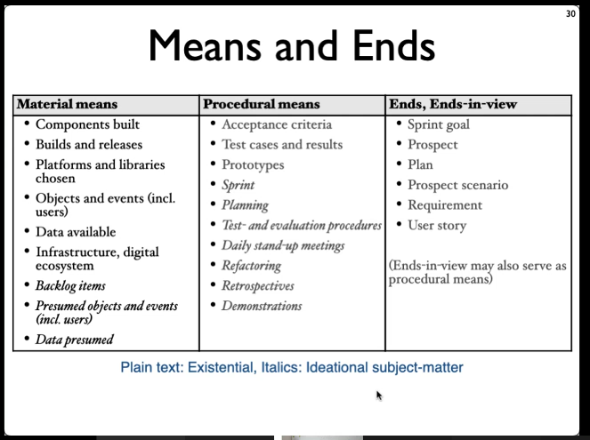

ESSENCE:
* Views: Product, Paradigm, Project, Process
* Roles: 

* Part of everyday work in software projects.
* Innovation tager hånd om _ikke-trivielle problemer_ opdaget i problemdomæney
* Hvad problemet er og hvad der kan løse det er problematisk. KAN ændre arbejdet på problemet.

* Product: Nyt produkt
* Process: 
* Project: Part of a solution
* Paradigm: When 

## 3 paradigmer af software udvikling
* Dokumentorienteret: Vandfald. Top-down, **PLANorienteret**
* Agil: Incremental, dynamisk, **brugerfokuseret**
* Pragmatisk: Hyperkompleks. **Problem-orienteret**.
  * Hyperkompleks: SÅ MEGET kompleksitet at man ikke kan lave tage hånd om det inden rimelig tid. 
    * Systemer kan ikke længere seperares fra hinanden.
    * Systemer skal være mere intelligente.

## Core concerns

## Structures in ESSENCE

## Idé
En hypotese. Et eksperiment. Vi kan teste det og se om det virker.

# Deweyan Inquiry

# Means and Ends

