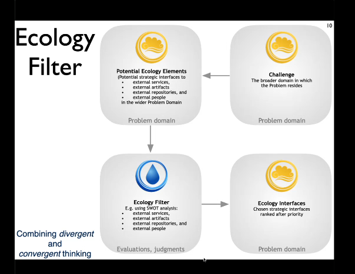

# The Pre-Project
Hypercomplexity: Cannot scope a project optimatically from the start.
Balance between ambitions and the doable.
SCOPE the problem. Create an **INITIAL** scope.

Ecology: Hvilke eksterne services, artifakter, personer i problem domænet ville det være strategisk vigtigt at interface med?

*Anthropocene age*: Environment is largely formed by human activity.
Need to start the project on set of assumptions about the environment.

## Figur: VENSTRE SIDE

## Ecology filter

### Taxonomy
* External services: Use without modification
* External artifact: Sensors, actuators.
* External repositories: Collecting, storing or aggregating information via trvial interfaces
* External People: Specific people, organizations stakeholders.

## Evaluating Ecology Ideas

### Single idea evaluation
* SWOT
* PMI-evaluation 
  * Plus: Positive.
  * Minus: Negative.
  * Interesting: Others.

### Comparative idea evaluation
* NAF-evaluation
  * Novelty
  * Attractiveness
  * Feasability

* SWOT
  * Translate numbers into numbers.

* Pairwise Comparison

Linker MEGET sammen med [Leverage](essence_preproject_leverage.md)