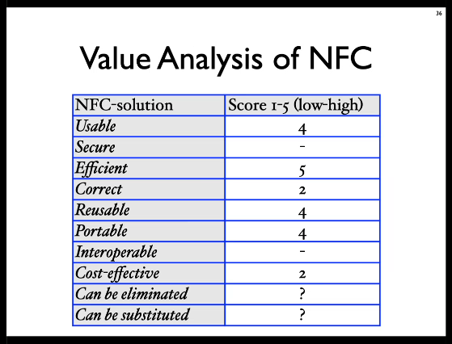

# The Pre-Project
Hypercomplexity: Cannot scope a project optimatically from the start.
Balance between ambitions and the doable.
SCOPE the problem. Create an **INITIAL** scope.

Leverage: Hvilke teknologier burde blive tilegnet som keystones, centrale principper i en god løsning?

Newer technologies may arrive that we cannot expect.

## Figur: HØJRE SIDE

## Leverage filter

## Taxonomy
* Technologies
* Internal artifacts
* Internal repositories
* Internal people: Users, social networks.

Jem & Fix, Harald Nyborg vs Silvan, Bauhaus:
Silvan har "faglærte" medarbejdere, mens discount har ikke.

## Evaluation:
### Single-idea evaluation
* SWOT
* Value Analysis

* PCRT: 
  * Power
  * Cost
  * Risk
  * Time

## Comparative Idea Evaluation
* PCRT
* Samme teknikker som til [Ecology](essence_preproject_ecology.md)