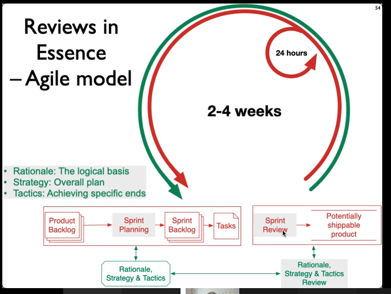
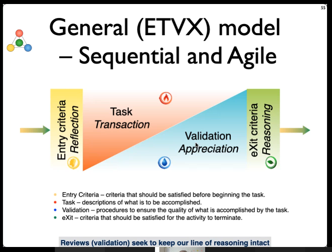

SCRUM: Focus on what to build and where to build.  RØD i figur

Essence: Reasoning in the project. GRØN i figur
Rationale
Strategy
Tactics

Look into the planing of the project at the start of the sprint. Sprint review is also used to review the RST.

## ETVX
* Entry Criteria: criteria that should be satisfied before beginning the task
* Task: Descriptions of what is to be accomplished by the cell.
* Validation: Procedures to ensure the quality of what is accomplished by the task.
* eXit Criteria: Criteria that should be satisfied for the activity to terminate.

Design by contract.
If we send the right data into the model and implemented correctly, we have a guarantee of the output. A model of the configuration table. 

## BASED ON THE REVIEW, we decide: Pivot or Preservere?
Bliver til en træstruktur hvoraf man kan beslutte om man skal fortsætte eller pivot.

Reasons to Pivot:
* Internal inconsistencies
* External dynamics - Changes in one place may incour changes in the project.
  * IT value
  * Business value
  