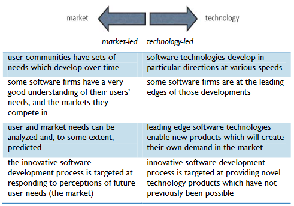

## Rose kapitel 4

### Vandfaldsmodellen
Hvert skridt skal være fyldt ud inden man kan gå til næste skridt.

### Boeing innovation model

## Promovere agile metoder innovation?
Iflg. Rose: Nej. 
Nogle elementer af agil udvikling er nødvendig for software innovation, men en agil process er ikke nok.

### Innovation ledet af marked eller teknologi

## 6 innovation process strategier
* 1: creative requirement analysis
  * Kreativitets tilstande: Exploratory, combinatorial and transformational.
* 2: the designed process framework
  * ESSENCE
* 3: low tech prototyping
  * Fra papir, til mockups, til mere højtek kode simulationer og kode prototyper
* 4: user-driven software innovation
  * Læner sig op ad "superbruger" for at kunne høre om deres idéer og så implementere dem i kode.
* 5: community development
  * Innovation som et samfund. 2 måder: Lead user community som Apache foundation eller content model som fx Second Life.
* 6: the research prototype
  * ???

## Overblik
Den innovative software udvikler skal take kontrol over processen.
Udviklere skal mixe og matche hensigtsmæssigt. 
**Process går i stå**: Udvikler skal introducere noget ind til processen som gør at de kan komme videre.
**Processen garantere ikke success**