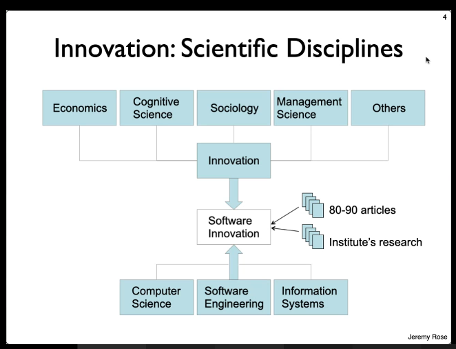
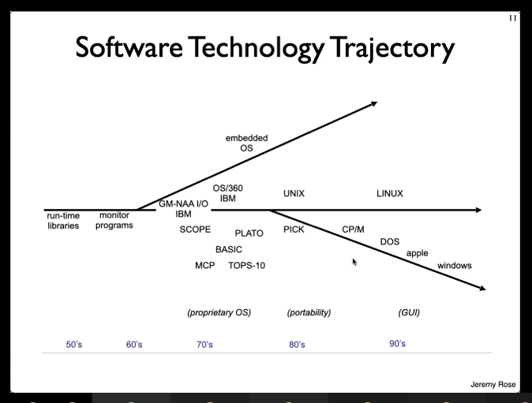
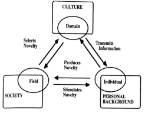
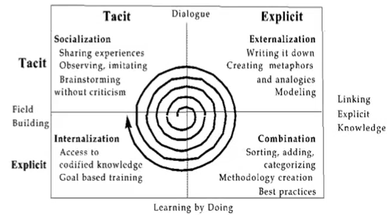
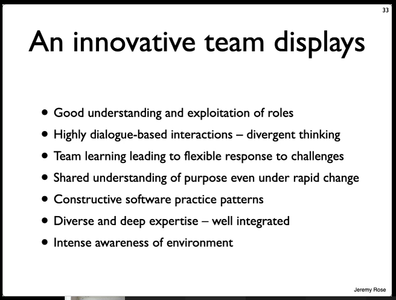

# Rose kapitel 6

3 forskellige teams:
* Dysfunctional team - Folk arbejder i små grupper
* Functional team - Folk arbejder sammen
* Innovative team - ??

Der 

## Scientific disciplines

## Software innovation Overview:
* **Invention**: The creative act or process and its result (e.g. a software program). The good idea.
* **Exploitation**: Commercial development and adaptation to practical situations. Product starts being used
* **Diffusion**: Adoptation by a wider audience. Audience takes it.

Entrepanear crates a new something:
* New product
* New process

Eventually competitors catch up and crate a new equlibrium.

Jeremy's perspective:
Linking between process and product.
Rover to Mars: No changes.

In Essence innovation: We only talk about when we change the life of someone else.
Something that affects someone else.

Jeremy: Our only changes to our own process and calls that innovation.

## Technology trajectory

## Technology convergence

## Innovation community
* Physical: Silicon Valley, Shenzhen
* Virtual: GitHub for open source

## Innovation networks
* Invisible college, through network
* Knowledge exchange: Two way flow of 
* Innovation as a social process. Domain, field and individual.
  * 
* Reflective practice
* Knowledge as a social process.

## Knowledge: Absorptive Capacity

## Innovation/Creativity Factors
* Negative Factors
  * Creativity barriers
    * *Time pressure*
    * *Stress*
    * Bureaucracy
    * *Routine work*
    * *Resource shortage*
      *Kursiv = promote creativity*
  * Group dysfunction
* Positive factors
  * Software team roles
    * Formative:
      * XP: Coach, programmer, tester
      * SCRUM: Product owner, scrum master
    * Innovative:
      * ESSENCE: Challenger Responder, Anchor, Child
  * Communicative interactions
  * team learning
  * Expertise integration

